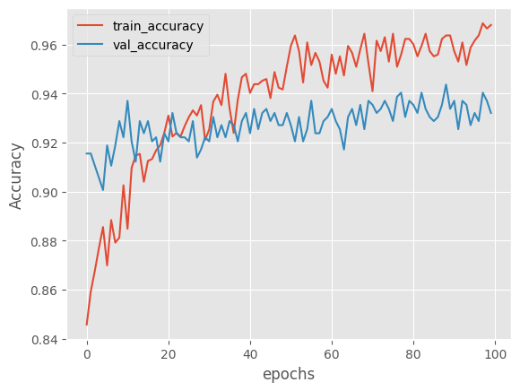
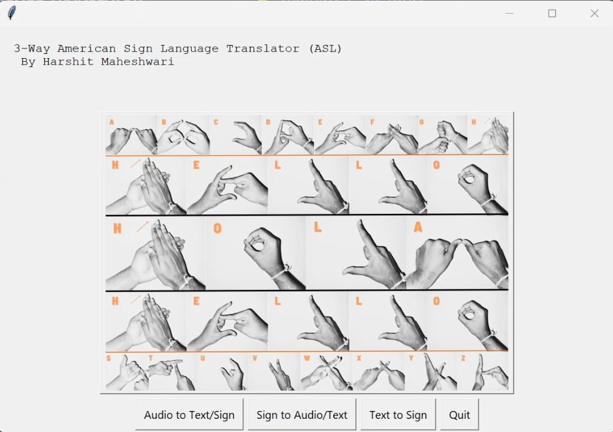

# 3-Way Sign Language Translator with GUI

## Table of Contents
- [Introduction](#introduction)
- [Features](#features)
- [Screenshots](#screenshots)
- [Installation](#installation)

## Introduction
Welcome to the **3-Way Sign Language Translator**! This innovative tool bridges the communication gap by translating between **Audio**, **Video**, and **Text** into all other supported formats.
## Features
- **Multi-Input Support**: Translate from Audio, Video, and Text inputs.
- **Comprehensive Output**: Outputs are available in Audio, Video, and Text formats.
- **Original Graphics**: All hand sign graphics used in the GUI are 100% original, ensuring a unique and consistent user experience.
- **High Accuracy**: Leveraging advanced machine learning algorithms to ensure precise translations.
- **User-Friendly Interface**: Intuitive design that makes navigation and usage straightforward for all users.

## Screenshots
### Accuracy Overview


### User Interface


## Installation
To get started with the 3-Way Sign Language Translator, follow these steps:

1. **Clone the Repository**
   ```bash
   git clone https://github.com/Harshit2k1/3-Way-Sign-Language-Translator-with-GUI.git

2. **Navigate to the Project Directory**
   ```bash
   cd 3-Way-Sign-Language-Translator-with-GUI

3. **Install Dependencies**

4. **Run the Application**
   ```bash
   python main.py


   
